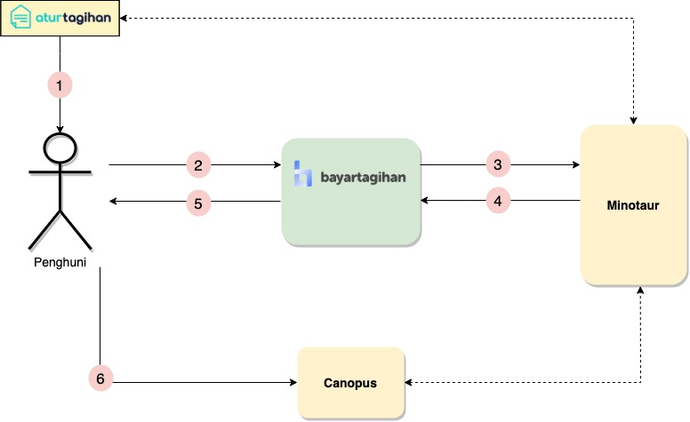

= Architecture Argus

== Related System

Argus sebagai sistem Front-End sepenuhnya berhubungan dengan Back-End dengan yaitu https://alterra.atlassian.net/plugins/servlet/servicedesk/customer/confluence/shim/spaces/SYS/pages/140968510/Minotaur[Minotaur]

== High Level Architecture

Keterangan :

1. Atur tagihan generate link pembayaran untuk penghuni.
2. Penghuni mengakses sistem Bayar Tagihan (Argus).
3. Argus mengirim request untuk data tagihan kepada Minotaur.
4. Minotaur mengirimkan data tagihan.
5. Penghuni menerima rincian tagihan.
6. Penghuni melakukan pembayaran sesuai metode pembayaran yang dikehendaki

Setelah pembayaran diterima, maka canopus akan memberikan callback kepada minotaur dan minotaur akan melakukan update status pembayaran ke Atur Tagihan dan hasilnya bisa terlihat pada bayar tagihan.
